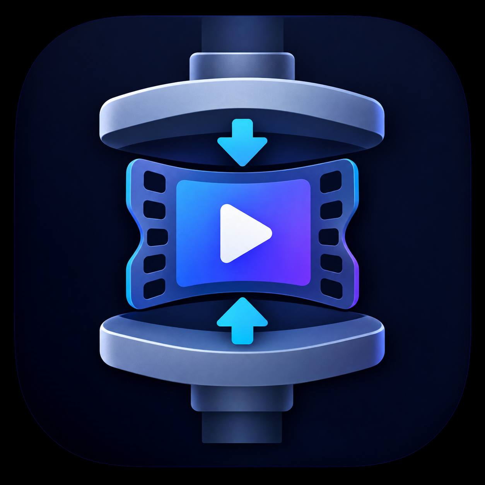
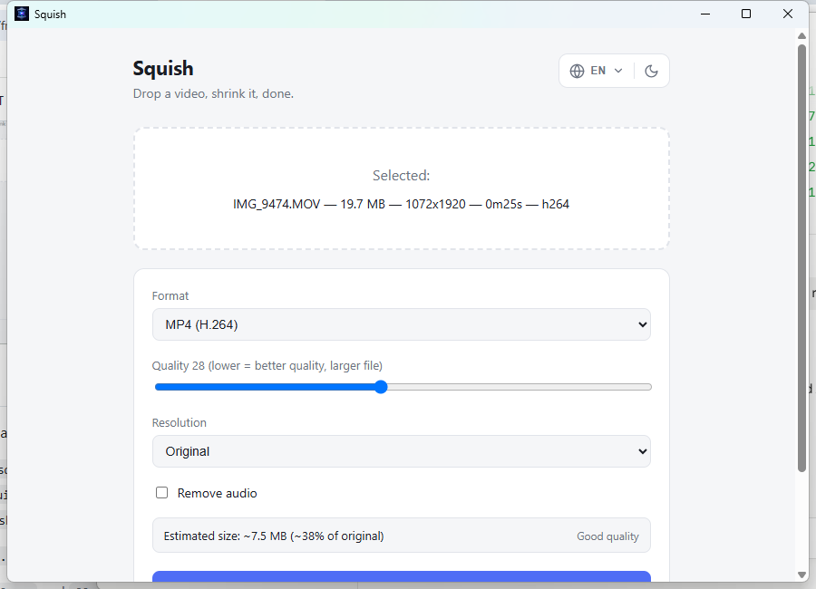

<div align="center">



# Squish

**Drop a video, shrink it, done.**

A fast, zero-dependency, cross-platform desktop video compressor.
No uploads, no accounts, no watermarks, and nothing to install first — FFmpeg ships inside the app.

[](https://github.com/freeb5d/squish/releases/latest)
[](https://github.com/freeb5d/squish/actions/workflows/build.yml)
[](LICENSE)
[](https://github.com/freeb5d/squish/releases/latest)

</div>

---

## Overview

Pick a video, or drag one onto the window. Squish shows you its resolution, duration, codec, and
size, then lets you dial in a format and quality — with a **live estimate of the output size**
before you even hit compress. No prerequisites, no PATH configuration: FFmpeg is embedded in the
binary and extracted automatically on first run.

<div align="center">

</div>

## Features

| | |
|---|---|
| 📦 **Zero dependencies** | FFmpeg/FFprobe are bundled in the executable — nothing to install |
| 🎬 **Formats** | MP4 (H.264), MP4 (H.265 — smaller), WebM (VP9) |
| 🎚️ **Quality control** | CRF slider, live-labeled from "Excellent" to "Low" |
| 📐 **Resolution scaling** | Original, 75%, 50%, 25% |
| 🔇 **Audio** | Keep, or strip it entirely |
| 📊 **Live estimate** | Predicted output size and quality before you compress |
| 🌍 **8 languages** | English, فارسی, العربية, 简体中文, Русский, Français, Deutsch, Te Reo Māori — full RTL support for Persian and Arabic |
| 🌗 **Theming** | Light / dark, remembers your choice |
| 🔄 **In-app updates** | Checks GitHub for new releases and installs them with a live progress bar (%, speed) — no manual download |
| 🖱️ **Drag & drop** | Or use the native file picker |
| 🪶 **Lightweight UI** | Native WebView, not a bundled Chromium/Electron runtime |

## Download

Grab a prebuilt binary for your platform from the
**[latest release](https://github.com/freeb5d/squish/releases/latest)** — just run it, no setup required:

- **Windows** — `squish-windows-amd64.exe`
- **macOS** — `squish-macos-universal.zip` (Intel + Apple Silicon)
- **Linux** — `squish-linux-amd64`

Every push of a `v*.*.*` tag builds and publishes all three automatically via
[GitHub Actions](.github/workflows/build.yml), with FFmpeg baked into each binary at build time.
Squish also checks for new releases itself and can update in place — see **About** in the app footer.

## How it works

Squish doesn't reimplement video codecs — like every tool in this space, it drives `ffmpeg` /
`ffprobe` under the hood and wraps them in a native, lightweight GUI (no Chromium/Electron bundle).
Unlike most tools in this space, it doesn't require you to install FFmpeg separately: the CI
pipeline downloads the platform's FFmpeg binaries and embeds them directly into the executable via
Go's `embed` package. On first run, Squish extracts them to a per-user cache directory and uses
that copy — no PATH configuration, no separate installer.

The Go backend ([`app.go`](app.go)) builds the ffmpeg command from your chosen settings, parses
`-progress` output to drive the compression progress bar, and exposes it all to a small vanilla
HTML/JS frontend via [Wails](https://wails.io) bindings. The self-update flow
([`update.go`](update.go), [`update_windows.go`](update_windows.go),
[`update_unix.go`](update_unix.go)) downloads the matching release asset with progress events, then
replaces the running binary in place and relaunches.

## Building from source

**Prerequisites**

- [Go](https://go.dev/dl/) 1.21+
- [Wails CLI](https://wails.io/docs/gettingstarted/installation) v2: `go install github.com/wailsapp/wails/v2/cmd/wails@latest`
- FFmpeg is *not* required to build — a plain `wails build` falls back to whatever `ffmpeg`/`ffprobe`
  are on your `PATH` at runtime (handy for local development). To produce a fully self-contained
  binary like the official releases, place real `ffmpeg`/`ffprobe` binaries at
  `resources/ffmpeg/<windows|darwin|linux>/` before building — see
  [`.github/workflows/build.yml`](.github/workflows/build.yml) for exactly how CI does this.

```bash
git clone https://github.com/freeb5d/squish.git
cd squish
wails dev      # run in dev mode with hot reload
wails build    # produce a release binary in build/bin/
```

## Project layout

```
main.go                entrypoint, Wails app config
app.go                  backend: file dialogs, ffprobe/ffmpeg wrapper, progress events
update.go               GitHub release checks + download-with-progress
update_windows.go       self-update install step (Windows: batch-script relaunch dance)
update_unix.go          self-update install step (macOS/Linux: in-place binary swap)
ffmpeg_bundled.go       extracts the embedded ffmpeg/ffprobe binaries on first run
ffmpeg_embed_*.go       go:embed directives, one per platform
exec_windows.go         hides the console window ffmpeg/ffprobe would otherwise flash
exec_other.go
version.go              app version constant
resources/ffmpeg/       placeholder (0-byte) binaries in git; CI fills these in before building
frontend/dist/          static HTML/CSS/JS frontend (no build step required)
  i18n.js                 translation strings for all 8 languages
  fonts/                  embedded Vazirmatn font for Persian
.github/workflows/      CI: downloads FFmpeg, builds, and releases Windows/macOS/Linux binaries
```

## License

[MIT](LICENSE)

---

<div align="center">
<sub>Made with ❤️ by Kaveh</sub>
</div>
