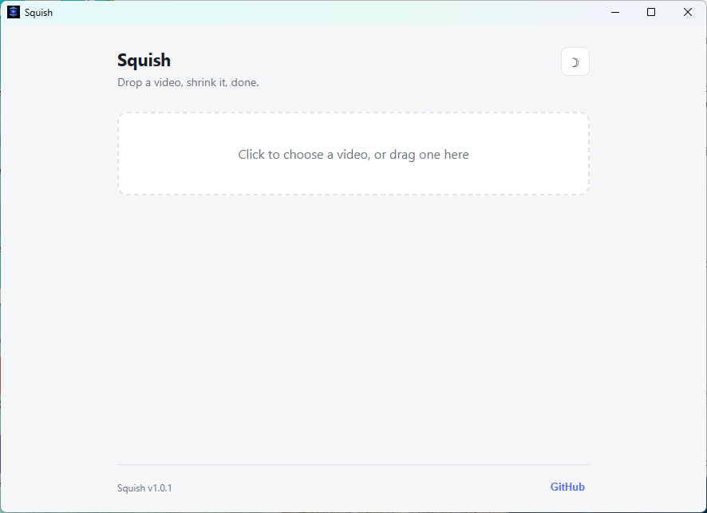

<div align="center">


# Squish

**Drop a video, shrink it, done.**

A tiny, fast, cross-platform desktop video compressor.
No uploads, no accounts, no watermarks — everything runs locally through FFmpeg.

[](https://github.com/freeb5d/squish/releases/latest)
[](https://github.com/freeb5d/squish/actions/workflows/build.yml)
[](LICENSE)
[](https://github.com/freeb5d/squish/releases/latest)

</div>

---

## What it does

Pick a video, or drag one onto the window. Squish shows you its resolution, duration, codec, and
size, then lets you dial in a format and quality — with a **live estimate of the output size**
before you even hit compress.

| | |
|---|---|
| 🎬 **Formats** | MP4 (H.264), MP4 (H.265 — smaller), WebM (VP9) |
| 🎚️ **Quality control** | CRF slider, live-labeled from "Excellent" to "Low" |
| 📐 **Resolution scaling** | Original, 75%, 50%, 25% |
| 🔇 **Audio** | Keep, or strip it entirely |
| 📊 **Live estimate** | Predicted output size and quality before compressing |
| 🌗 **Theming** | Light / dark, remembers your choice |
| 🔔 **Update checks** | Notifies you when a newer release is out |
| 🖱️ **Drag & drop** | Or use the native file picker |

## Screenshot

<div align="center">


</div>

## Download

Grab a prebuilt binary for your platform from the
**[latest release](https://github.com/freeb5d/squish/releases/latest)**:

- **Windows** — `squish-windows-amd64.exe`
- **macOS** — `squish-macos-universal.zip` (Intel + Apple Silicon)
- **Linux** — `squish-linux-amd64`

Every push of a `v*.*.*` tag builds and publishes all three automatically via
[GitHub Actions](.github/workflows/build.yml).

> Squish needs `ffmpeg` and `ffprobe` on your system `PATH` to run — see
> [ffmpeg.org/download.html](https://ffmpeg.org/download.html).

## How it works

Squish doesn't reimplement video codecs — like every tool in this space, it shells out to the
`ffmpeg` / `ffprobe` binaries already on your machine and wraps them in a native, lightweight GUI
(no Chromium/Electron bundle). The Go backend ([`app.go`](app.go)) builds the ffmpeg command from
your chosen settings, parses `-progress` output to drive the progress bar, and exposes it all to a
small vanilla HTML/JS frontend via [Wails](https://wails.io) bindings.

## Building from source

**Prerequisites**

- [Go](https://go.dev/dl/) 1.21+
- [FFmpeg](https://ffmpeg.org/download.html) (`ffmpeg` and `ffprobe` on your `PATH`)
- [Wails CLI](https://wails.io/docs/gettingstarted/installation) v2: `go install github.com/wailsapp/wails/v2/cmd/wails@latest`

```bash
git clone https://github.com/freeb5d/squish.git
cd squish
wails dev      # run in dev mode with hot reload
wails build    # produce a release binary in build/bin/
```

## Project layout

```
main.go             entrypoint, Wails app config
app.go               backend: file dialogs, ffprobe/ffmpeg wrapper, progress events
update.go            GitHub release version checks
version.go           app version constant
exec_windows.go       hides the console window ffmpeg/ffprobe would otherwise flash
exec_other.go
frontend/dist/        static HTML/CSS/JS frontend (no build step required)
.github/workflows/    CI: builds + releases Windows/macOS/Linux binaries on tag push
```

## License

[MIT](LICENSE)
